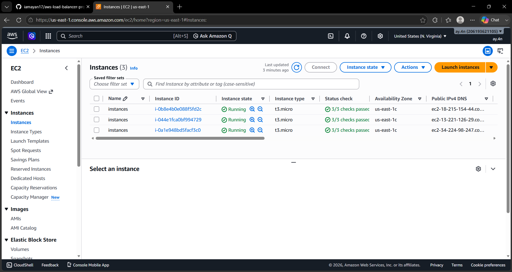
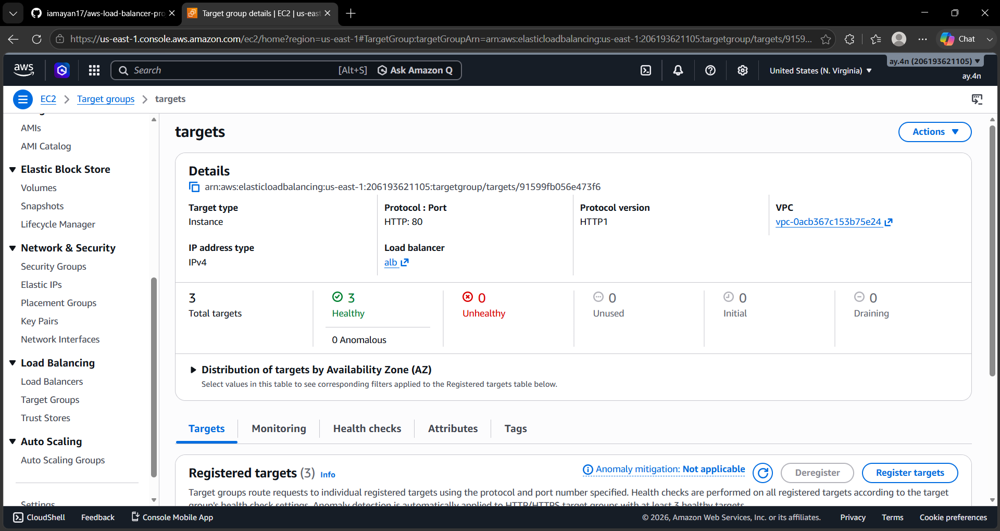
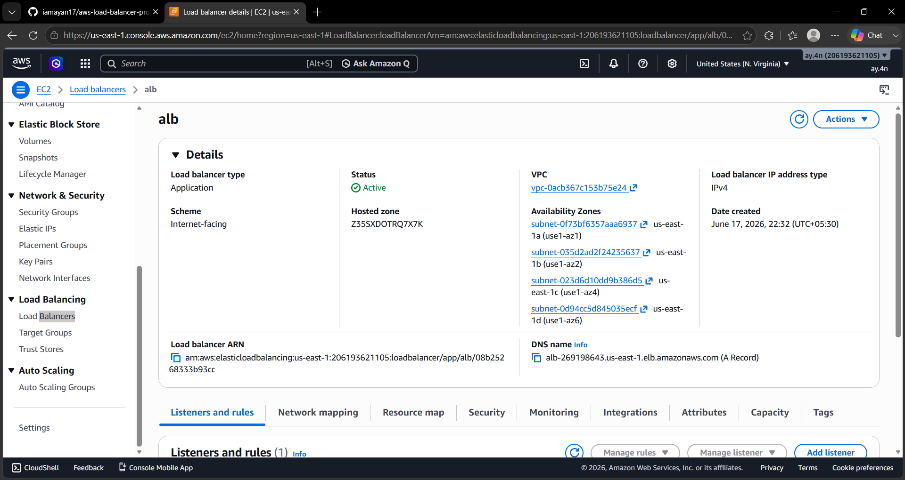

# AWS Application Load Balancer with 3 EC2 Instances

## Project Overview

This project demonstrates AWS High Availability using:

- 3 EC2 Instances
- Application Load Balancer (ALB)
- Target Group
- Apache Web Server
- Health Checks

## Architecture

Internet
   |
   v
Application Load Balancer
   |
-------------------------
|         |          |
EC2-1    EC2-2     EC2-3

## Project Workflow

1. Created 3 EC2 instances
2. Installed Apache Web Server
3. Configured custom webpages
4. Created Target Group
5. Registered EC2 instances
6. Created Application Load Balancer
7. Attached Target Group to ALB
8. Verified health checks
9. Tested traffic distribution

## Screenshots

### EC2 Instances

### Target Group

### Load Balancer

### Instance 1

### Instance 2

### Instance 3

## Result

The Application Load Balancer successfully distributes incoming traffic across three EC2 instances.